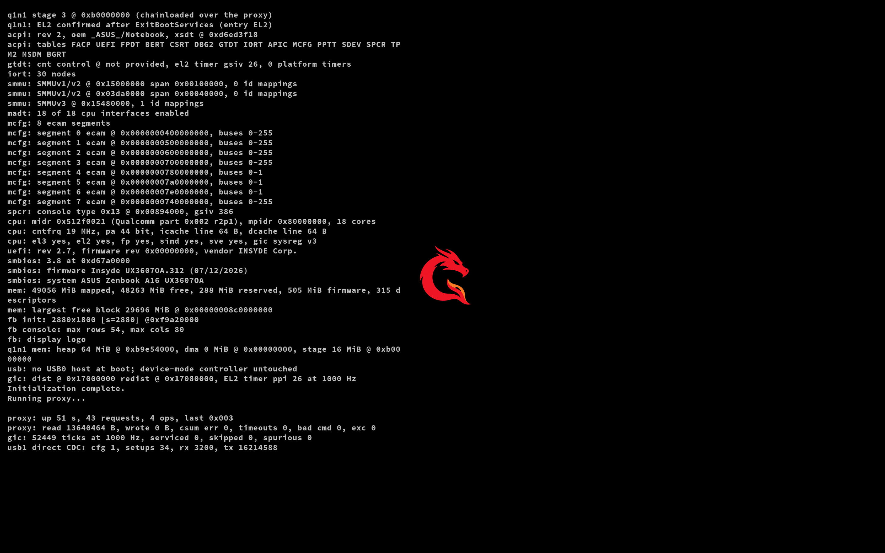

# q1n1: m1n1 on a Snapdragon laptop

A fork of [m1n1](https://github.com/AsahiLinux/m1n1) retargeted from Apple
Silicon to the ASUS Zenbook A16 (UX3607OA / Snapdragon X2E-96-100). Where m1n1
is loaded by iBoot, q1n1 is a UEFI application: firmware loads it, it takes the
machine at EL2 after `ExitBootServices`, and then serves m1n1's proxy protocol
so a host can drive the hardware interactively.



*The screen above is the real thing, not a mockup: the framebuffer was read out
of the running machine over the proxy while it sat at EL2.*

**[Installation and usage →](docs/A16-INSTALL.md)**

## What works

- **EL2 after ExitBootServices** on real hardware, with a framebuffer console.
  Entered directly, without slbounce. See the
  [first hardware boot record](docs/A16-FIRST-EL2-BOOT.md).
- **The m1n1 proxy protocol at EL2** over USB, with guarded MMIO access, memory
  transfer and code upload, so the usual m1n1 host-side idioms work.
- **Boot control**: `tools/a16ctl.py` boots the laptop into q1n1 from Windows,
  from its boot window, or from q1n1 itself — a q1n1-to-q1n1 restart never
  passes through Windows. Windows stays first in the firmware boot order and a
  failed payload falls back to it.
- **Chainloading**: replace the running EL2 code in ~0.3 s without rebooting,
  which is what makes this iterable at all.
- **Its own USB stack on both A16 ports.** Each controller discovers a working
  host/NCM or device/CDC connection, recovers after cable moves, and serves the
  proxy independently. The Mac reader discovers either transport without a
  fixed serial path or network-interface number. Direct connections passed all
  six Mac/A16 port pairings; dock connections passed both A16 ports on the
  tested working Mac port. See the
  [port qualification record](docs/A16-USB-PORT-INDEPENDENCE.md) for evidence
  and the remaining dock qualification limits.
- **UCSI 2.1** register access and connector queries.

Not yet: the guest hypervisor, SMP, or any Apple-specific drivers.

## Records

Each piece has a written record of how it was established, including the things
that turned out to be wrong:

| | |
| --- | --- |
| [A16-INSTALL.md](docs/A16-INSTALL.md) | build, install, boot, connect, recover |
| [A16-Q1N1-PROXY.md](docs/A16-Q1N1-PROXY.md) | EL2 proxy, boot control, xHCI/NCM, the UDP transport |
| [A16-USB-PORT-INDEPENDENCE.md](docs/A16-USB-PORT-INDEPENDENCE.md) | dual-controller recovery, automatic discovery, physical port qualification |
| [A16-DIRECT-USB-C.md](docs/A16-DIRECT-USB-C.md) | dock-free direct USB-C, and the data-role dead ends |
| [A16-FIRST-EL2-BOOT.md](docs/A16-FIRST-EL2-BOOT.md) | first EL2 execution on hardware |
| [A16-USB-EL2-SERIAL.md](docs/A16-USB-EL2-SERIAL.md) | USB after ExitBootServices |
| [A16-USB-DOCK.md](docs/A16-USB-DOCK.md) | CDC ACM serial through the dock |
| [A16-UCSI-REGISTERS.md](docs/A16-UCSI-REGISTERS.md) | USB-C transport and data-role experiments |
| [A16-BOOT.md](docs/A16-BOOT.md) | boot and serial guide |

## Build and test

```shell
make uefi        # build/uefi/q1n1.efi and the chainloadable stages
```

QEMU boots the real binary to EL2 and checks it end to end, including two
chainloads; the native suites run the drivers against register models under
ASan/UBSan, with no firmware and no physical MMIO:

```shell
python3 tools/test-uefi.py --proxy
python3 tools/test-q1n1-proxy.py
python3 tools/test-q1n1-xhci.py
python3 tools/test-q1n1-ncmproxy.py
python3 tools/test-q1n1-ports.py
```

QEMU does not model this machine's Type-C hardware, so the direct-USB path is
covered by the native tests plus the hardware logs cited in
[A16-USB-PORT-INDEPENDENCE.md](docs/A16-USB-PORT-INDEPENDENCE.md).

## Boot emblem

The mark on the boot screen is q1n1's own dragon, an original project emblem
packaged from `data/q1n1/` — see that directory's README for how it was made and
how to repackage it. It carries an alpha channel and is composited onto the
screen, so it does not stamp a black square over whatever firmware left there.
A chainloaded stage takes its placement from the host:

```shell
python3 tools/q1n1proxy.py chainload build/uefi/q1n1-stage.bin --logo corner
```

`centre` is the default and matches m1n1's placement; `corner` parks the emblem
in a different corner per chainload generation, so the screen says at a glance
which one is running; `none` draws nothing; `asahi` draws the upstream Asahi
logomark instead.

## Credit

This is a fork of the [Asahi Linux](https://asahilinux.org/) project's m1n1. The
proxy protocol, the host client structure and most of the tree are theirs; MIT
licence inherited. Upstream's own README, build instructions for Apple Silicon
and user guide live at [AsahiLinux/m1n1](https://github.com/AsahiLinux/m1n1) and
the [Asahi wiki](https://asahilinux.org/docs/sw/m1n1-user-guide/).

## License

m1n1 is licensed under the MIT license, as included in the [LICENSE](LICENSE) file.

* Copyright The Asahi Linux Contributors

Please see the Git history for authorship information.

Portions of m1n1 are based on mini:

* Copyright (C) 2008-2010 Hector Martin "marcan" <marcan@marcan.st>
* Copyright (C) 2008-2010 Sven Peter <sven@svenpeter.dev>
* Copyright (C) 2008-2010 Andre Heider <a.heider@gmail.com>

m1n1 embeds libfdt, which is dual [BSD](3rdparty_licenses/LICENSE.BSD-2.libfdt) and
[GPL-2](3rdparty_licenses/LICENSE.GPL-2) licensed and copyright:

* Copyright (C) 2014 David Gibson <david@gibson.dropbear.id.au>
* Copyright (C) 2018 embedded brains GmbH
* Copyright (C) 2006-2012 David Gibson, IBM Corporation.
* Copyright (C) 2012 David Gibson, IBM Corporation.
* Copyright 2012 Kim Phillips, Freescale Semiconductor.
* Copyright (C) 2016 Free Electrons
* Copyright (C) 2016 NextThing Co.

The ADT code in mini is also based on libfdt and subject to the same license.

m1n1 embeds [minlzma](https://github.com/ionescu007/minlzma), which is
[MIT](3rdparty_licenses/LICENSE.minlzma) licensed and copyright:

* Copyright (c) 2020 Alex Ionescu

m1n1 embeds a slightly modified version of [tinf](https://github.com/jibsen/tinf), which is
[ZLIB](3rdparty_licenses/LICENSE.tinf) licensed and copyright:

* Copyright (c) 2003-2019 Joergen Ibsen

m1n1 embeds portions taken from
[arm-trusted-firmware](https://github.com/ARM-software/arm-trusted-firmware), which is
[BSD](3rdparty_licenses/LICENSE.BSD-3.arm) licensed and copyright:

* Copyright (c) 2013-2020, ARM Limited and Contributors. All rights reserved.

m1n1 embeds [Doug Lea's malloc](ftp://gee.cs.oswego.edu/pub/misc/malloc.c) (dlmalloc), which is in
the public domain ([CC0](3rdparty_licenses/LICENSE.CC0)).

m1n1 embeds portions of [PDCLib](https://github.com/DevSolar/pdclib), which is in the public
domain ([CC0](3rdparty_licenses/LICENSE.CC0)).

m1n1 embeds the [Source Code Pro](https://github.com/adobe-fonts/source-code-pro) font, which is
licensed under the [OFL-1.1](3rdparty_licenses/LICENSE.OFL-1.1) license and copyright:

* Copyright 2010-2019 Adobe (http://www.adobe.com/), with Reserved Font Name 'Source'. All Rights Reserved. Source is a trademark of Adobe in the United States and/or other countries.
* This Font Software is licensed under the SIL Open Font License, Version 1.1.

m1n1 embeds portions of the [dwc3 usb linux driver](https://git.kernel.org/pub/scm/linux/kernel/git/torvalds/linux.git/tree/drivers/usb/dwc3/core.h?id=7bc5a6ba369217e0137833f5955cf0b0f08b0712), which was [BSD-or-GPLv2 dual-licensed](3rdparty_licenses/LICENSE.BSD-3.dwc3) and copyright
* Copyright (C) 2010-2011 Texas Instruments Incorporated - http://www.ti.com

m1n1 embeds portions of [musl-libc](https://musl.libc.org/)'s floating point library, which are MIT licensed and copyright
* Copyright (c) 2017-2018, Arm Limited.

m1n1 embeds some rust crates. Licenses can be found in the vendor directory for every crate.

The Asahi Linux logomark, embedded as `data/asahi_bootlogo_256.bin` for
`--logo asahi`, is copyright (c) 2021 soundflora* and Hector Martin, and is used
to reference the Asahi Linux project rather than to represent this fork. q1n1's
own dragon emblem is an original mark for this project and is not the official
Qualcomm or Snapdragon logo.
